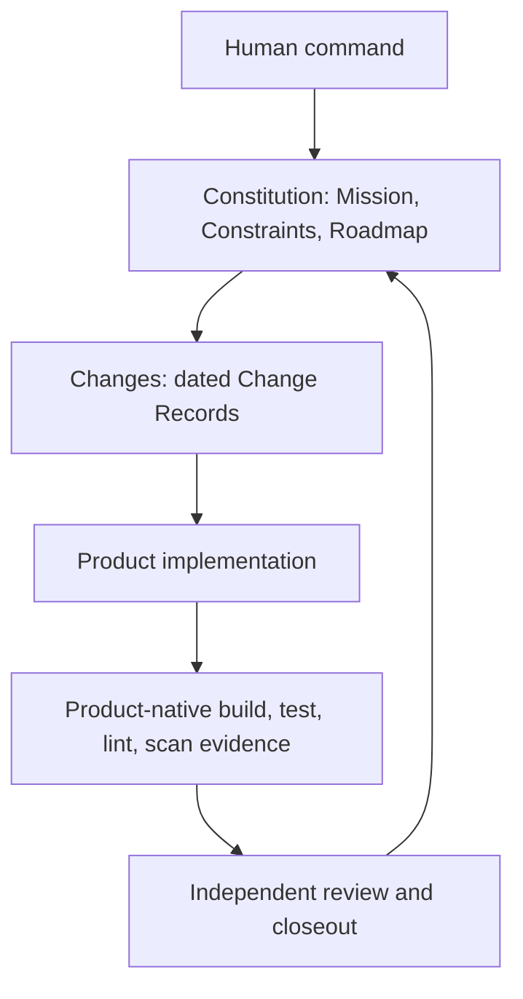
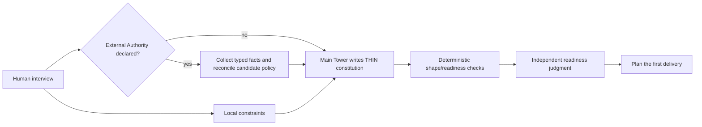
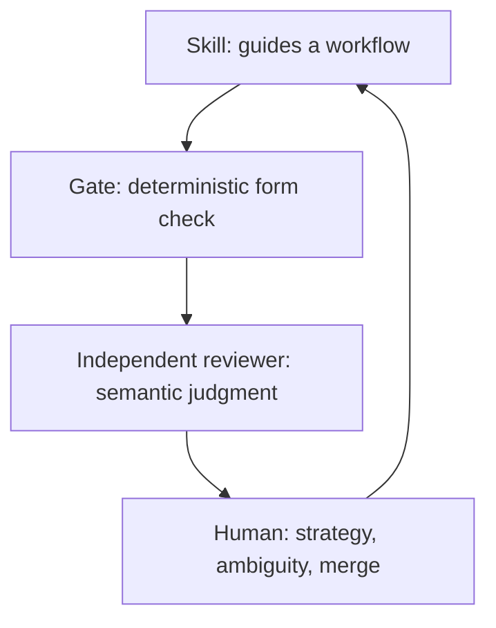

# Overview: How Control Tower works

Control Tower is a **human-commanded AI copilot method**. It makes a change traceable from a
strategic decision through an implemented result without claiming that a green check can replace
human judgment.

For the normative sources, read the [Manifesto](../../doctrine/MANIFESTO.md) and
[Operating Model](../../doctrine/operating-model.md). This page is the readable map, not a second
constitution.

## The three governing artifacts (the constitution)

[Mission](../reference/glossary.md#mission),
[Constraints](../reference/glossary.md#constraints), and
[Roadmap](../reference/glossary.md#roadmap) are the constitution: the human-controlled strategy
layer that keeps every delivery aligned. The diagram also shows the tactical and implementation
layers that make that strategy observable.

The **constitution** is the slow strategy layer: why the product exists, what must hold, and which
capability comes next. **Changes** are the fast tactical layer: one dated
[Change Record](../reference/glossary.md#change-record) containing the outcome, activated
obligations, short plan, evidence, corrections, closeout, and returned reviews. Product code and its
native toolchain produce implementation evidence. Review and closeout
connect that evidence back to the roadmap instead of leaving a completed change unaccounted for.

## Inception is THIN strategy, not the first feature

Every project begins with **local stakeholder constraints**. They are mandatory input even when no
external Authority exists. An Authority is optional: when explicitly bound, the Full profile's
generic advisors may collect relevant facts and reconciliation may produce a candidate policy lock
before the constitution is written. A candidate is not institutional approval, authenticity proof,
or a compliance claim.

The main Tower interviews the human and creates a THIN Mission, Constraints, and Roadmap.
Requirements and Architect do not produce inception. The readiness script checks structure; an
independent reviewer judges whether the strategy is coherent and proportionate before a feature is
planned.

## A feature-first delivery lifecycle

```mermaid
flowchart LR
    R[Choose roadmap capability] --> Q[EARS requirements]
    Q --> P{Policy reconciliation\nneeded?}
    P -- yes --> L[Refresh applicable policy facts/lock]
    L --> S[Plan and validation]
    P -- no --> S
    S --> D{Load-bearing design?}
    D -- yes --> A[ADR and independent architecture-review]
    D -- no --> C[Implement]
    A --> C
    C --> E[Product toolchain evidence]
    E --> F[One owner; committed and pushed; other writers stopped]
    F --> V[Independent review-slice observes target and heads]
    V --> T[Tower records returned actual result]
    T --> G[Existing merge-ready check]
    G --> X[Roadmap Delta closeout]
    X --> M[Human-gated merge]
```

The unit of work is a **delivery**: the smallest observable capability that did not exist before.
`plan-slice` does not begin as a blank questionnaire. The Tower reads the governing artifacts and
selectively relevant history, forms a working judgment, and raises only consequential concerns it
genuinely perceives. Alternatives and recommendations are hypotheses until the human confirms
them; only confirmed behavior becomes EARS. If no material concern is found, planning proceeds
without decorative challenge. If an explicitly bound Authority changes applicable policy,
reconcile it before coding and refresh stale requirements, plans, or reviews.

Design review is tiered. A [LIGHT](../reference/glossary.md#light) slice can implement after
planning; a load-bearing decision receives an ADR and independent architecture challenge before
code. An NFR enters that path only when it requires the load-bearing architectural answer. The
product's own toolchain produces build, test, lint, scan, or other
evidence named by the Change Record's obligations. The Tower does not pretend to be a universal language verifier.
Before final review, the Tower as coordinator stops or idles every other writer and names exactly
one producer as branch owner. That producer commits and pushes implementation, Change Record,
triggered design, closeout, and evidence. The no-edit reviewer observes the target and local/remote heads at start and
completion, then returns its complete actual result. Missing or moved relevant observations are
`STALE`/`BLOCK`; only after return does the Tower record the result.

Closeout starts only after the returned `PROMOTE` is recorded and the existing merge-ready check
passes. That gate still checks the durable `PROMOTE` and required residual dispositions; target/head
observations and post-review staleness are audit evidence and judgment, not new enforcement. Closeout
then records the [Roadmap Delta](../reference/glossary.md#roadmap-delta), and the human decides
whether to merge.

### LIGHT keeps one producer, not zero governance

For a bounded delivery with no Authority/policy delta, new dependency, active constraint-set change, or
load-bearing design, the main Tower can elicit, write the complete Change Record, implement, and close
out in one producer context. Requirements and Planner are optional specialist contexts, not
mandatory stages; Architect enters only for a load-bearing decision. The final Reviewer remains
fresh, no-edit, and independent.

If any eligibility boundary becomes uncertain, widen the Correction radius before continuing.
LIGHT does not create a fixed obligation tier, skip active constraints, remove product evidence, or
turn inception readiness into a per-delivery ritual.

The install profile follows the same proportionality. The copy-channel script installs LIGHT by
default: seven lifecycle Skills, Reviewer and Architect, four core governance workflows, and their
required contracts, gates, doctrine, and docs. Explicit `-Profile Full` adds Requirements/Planner,
Authority/GOVERNED extensions, eval/golden material, and framework-development CI. Both profiles are
non-destructive and leave product-native CI to the product toolchain.

> **Method-maintainer evidence note:** the existing Todo repository will be archived as the old
> baseline and a clean consumer will select its own first capability. That delivery will observe
> judgment-led planning, producer/agent count, artifact count, review rounds, available elapsed
> time, and defects in existing review/Roadmap Delta surfaces. It is not an adopter threshold or a
> new metric artifact.

## When implementation reveals a new fact

Use the [Correction radius](../reference/glossary.md#correction-radius) to change the nearest
authoritative artifact before continuing affected code. An implementation detail continues through
normal code/test evidence. A slice-local semantic correction refreshes affected Change Record or design
artifacts and stale evidence while preserving the roadmap outcome and governing boundaries. A
governance/strategy change uses the full replan and existing human controls.

This is artifact-first feedback, not code-first reconciliation. It also avoids forcing constitution
readiness and a course-correction ADR onto every local discovery. Radius selection remains semantic
judgment; uncertainty takes the wider path and stops for the human. Follow the
[course-correction how-to](../how-to/course-correct.md) for the routing procedure and examples.

## The three primitives

A [Skill](../reference/glossary.md#skill) is loaded on demand and guides the workflow; a
[Gate](../reference/glossary.md#gate) performs the deterministic form check. An independent
[Agent](../reference/glossary.md#agent) in the reviewer role, running without edit access and
outside the producer's context, judges completeness, scope, evidence, and drift. The human retains
command of Mission and Constraints, unresolved scope or architecture tension, and merge.

This boundary is deliberate. A passing script proves the condition it checks, not that a product
is correct or production-ready. A reviewer adds judgment, not mathematical proof. The method makes
those limits visible rather than hiding them behind automation.

## Producer != judge

The person or agent that produces a constitution, design, or delivery does not give the final
verdict on it. A reviewer works in a fresh, isolated context without edit access: it can run the
declared checks and challenge scope or evidence, but cannot repair what it judges. This makes a
green check necessary evidence rather than self-approval.

Independence is not authority to renegotiate the work. Final review verifies the approved contract
and blocks concrete violations; redesign preferences and future improvements do not hold the
current slice.

For final review, producer != judge also has an operational freeze: one producer owns the branch,
all other writers are stopped or idle, and protected work is committed and pushed before judgment.
The reviewer re-observes local and remote heads immediately before returning; the Tower records
exactly that returned result afterward. These observations and no-edit behavior do not authenticate
the reviewer, deterministically prevent outside writes, or prove semantic quality. A protected
post-review product, Change Record plan/design/obligations/evidence, constraint, Roadmap, or
changelog change requires a new committed
target and fresh review by method/reviewer judgment.

The instance records any change to this boundary in its own
[`constitution/decisions/`](../../../constitution/decisions/). The method deliberately does not
turn review identity, semantic quality, or every post-review diff into a new deterministic system.

## The autonomy envelope

The Tower can plan a bounded slice, implement it, run declared checks, and record a reviewed
closeout. The human commands strategy: changes to Mission or Constraints, ambiguous scope,
ownership boundaries, unresolved design tension, dependencies, deployment, and merge stop for a
human decision. This is controlled autonomy, not autonomous command.

## Continue

- Complete the [first-delivery tutorial](../tutorials/first-delivery.md).
- Use [safe extensions](extending-safely.md) without making optional tooling mandatory.
- Look up the [vocabulary](../reference/glossary.md), [skills](../reference/skills.md),
  [gates](../reference/gates.md), and
  [agents](../reference/agents.md).
