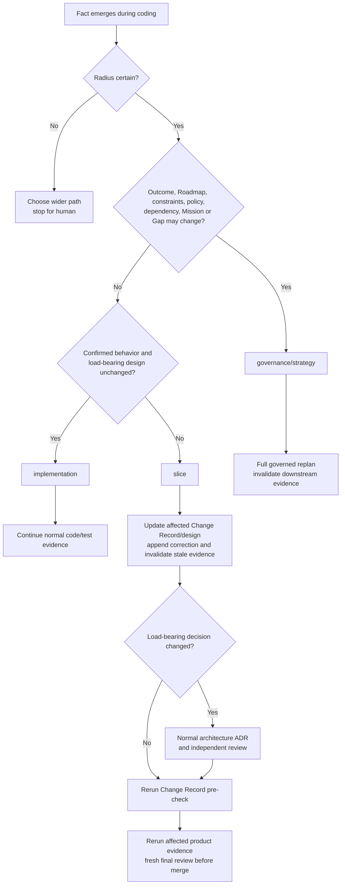

# How-to — Course-correct

> Route a discovery to the nearest authoritative artifact before continuing affected code. This
> keeps feedback fast without allowing code-first semantic drift.

## When

Use [`replan-and-correct`](../reference/skills.md) when coding, requirements, design, evidence, or
review reveals a fact that may change what the current plan means. A failing test whose fix changes
no confirmed semantics can stay in the normal implementation loop.

## Choose the Correction radius first

Radius selection is semantic judgment. It is not a deterministic classifier.



| Radius | Example | What to do |
|---|---|---|
| `implementation` | replacing an internal algorithm without changing observable behavior or a load-bearing design | continue with normal code and tests; retain the rationale in implementation evidence or final review |
| `slice` | clarifying an already in-scope invalid-input response while preserving outcome, Roadmap, active constraints, policy applicability, and dependencies | update affected requirements/plan/validation and design before affected code; refresh only stale evidence |
| `governance/strategy` | discovering a new external dependency or a policy applicability change | stop the local path and run the full governed replan |

If any listed boundary might change, or the radius is uncertain, use `governance/strategy` and stop
for the human.

## For a slice correction

1. Record the clarified fact and radius rationale in the Change Record's nearest decision/context,
   Corrections, evidence, or review surface.
2. Update affected Change Record sections and triggered design before continuing affected code.
3. Append invalidation of affected evidence/review attempts. A prior `PROMOTE` cannot remain current.
4. Run the Change Record pre-check before affected code continues.
5. After implementation, rerun affected product evidence and obtain a fresh independent final
   review before merge. Keep unrelated evidence.

A slice correction alone needs neither constitution readiness nor a course-correction ADR. If it
changes a load-bearing decision, the normal architecture ADR and architecture-review still apply.

## For governance/strategy

Use the full course-correction procedure:

1. classify the trigger and scan Mission, Constraints, Roadmap, Gap Register, and Change Record;
2. choose direct adjustment, rollback, or scope reduction;
3. preserve the existing minor/moderate/major and human-routing boundaries;
4. invalidate downstream requirements, design, evidence, and reviews made stale by the change;
5. rerun constitution readiness when Mission, Constraints, or Roadmap changed;
6. record an ADR when Mission or Constraints change, a load-bearing decision changes, or a new
   strategic direction requires a durable human decision.

Mission or Constraints changes always stop for the human. A changed Authority binding or policy
applicability result always uses this wider radius; it cannot authorize a compliance claim or
invent replacement semantics.

## The shape to remember

```text
Fact -> implementation | slice | governance/strategy
        code/tests        Change Record + stale evidence    full replan
```

Correct the nearest authoritative artifact first. Do not create an adjustment log, weaken a gate,
or keep a stale review current.

## See also

- The skill: [`../reference/skills.md`](../reference/skills.md)
- Run the everyday loop: [`run-a-slice.md`](run-a-slice.md)
- The autonomy edge: [`../explanation/overview.md`](../explanation/overview.md#the-autonomy-envelope)
- The ADR log: [`../reference/decisions.md`](../reference/decisions.md)
