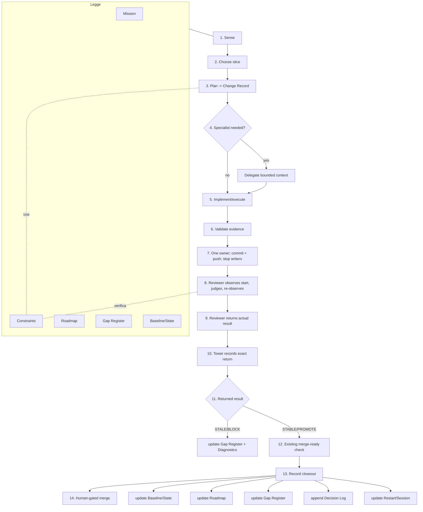
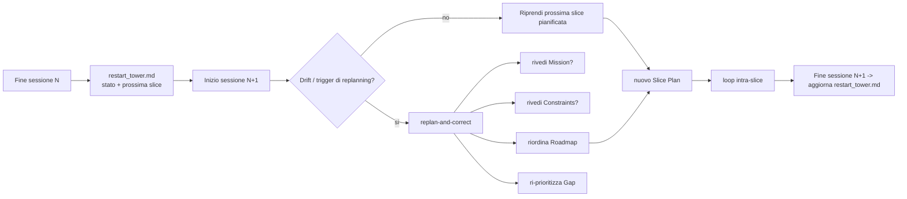
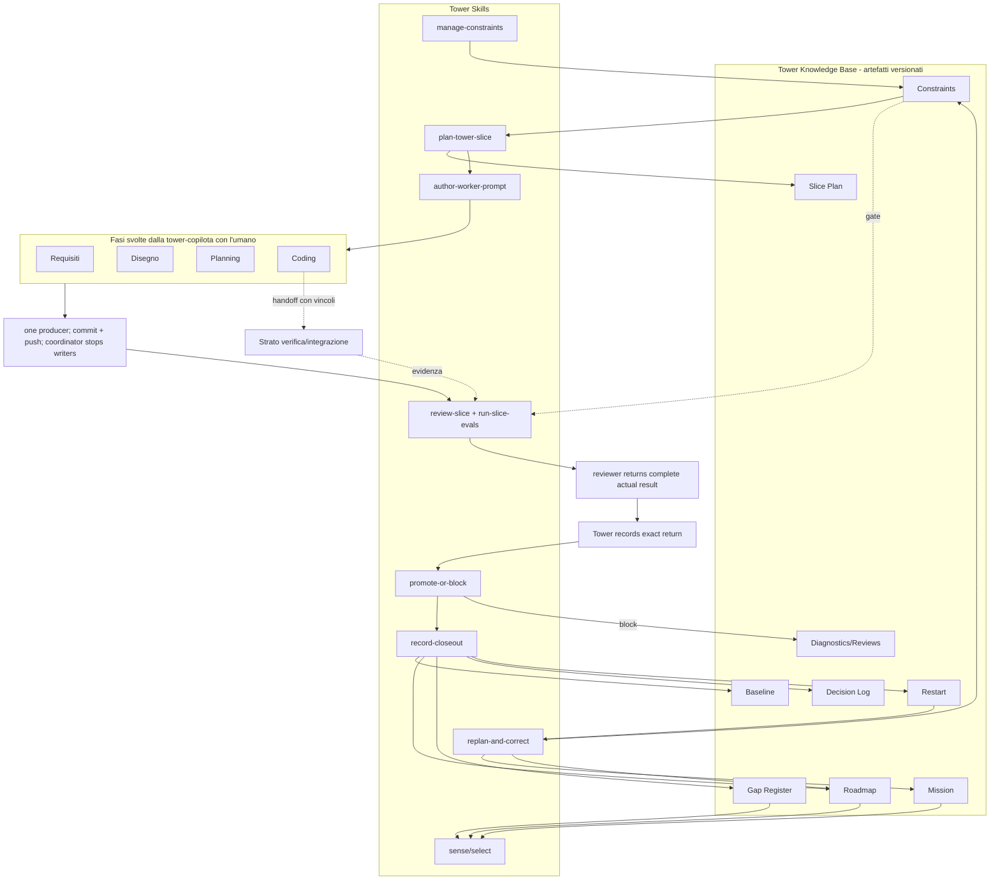

# Tower Artifacts, Skills, and Lifecycle (design di dettaglio)

> Documento di **dettaglio (design)** della metodologia Control Tower.
> Apice: `framework/doctrine/MANIFESTO.md` (principi, vocabolario, confini, lignaggio).
> Companion: `framework/doctrine/operating-model.md` (loop e ruoli, versione dominio-agnostica).
> Il boundary di runtime deterministico e' un tenet del metodo (Manifesto §7); un esempio
> concreto vive nelle torri data-mesh di riferimento (implementazione esterna del metodo).
> Scopo: specificare gli **artefatti governati**, le **skill** e le **dinamiche di ciclo di vita** che realizzano i principi del Manifesto.

Questo documento e' **dominio-agnostico**. Cita lo stato attuale del repository solo come evidenza di implementazione; la metodologia non dipende da un dominio specifico.

---

## 1. Scopo e relazione con il Manifesto

> **Contratto attivo Phase 30.** Ogni nuovo cambiamento usa un solo Change Record datato sotto
> `changes/`; il vecchio albero `specs/` e' ritirato dalla working tree e resta recuperabile dal
> commit immutabile indicato in `changes/0000-control-tower-baseline.md`. Dove l'analisi storica
> successiva descrive ancora file separati, il percorso eseguibile e normativo e' quello del Change
> Record definito dall'Operating Model, dal template `framework/contracts/change-record.md` e dai
> gate `change_record.py` / `check_change_record.py`.

Il Manifesto dichiara i principi; `framework/doctrine/operating-model.md` definisce il loop (Sense -> Choose -> Plan -> Delegate -> Review -> Promote/block -> Record -> Commit) e i ruoli. Questo documento specifica in dettaglio i tre elementi operativi necessari per applicare il metodo a un'app enterprise complessa:

1. **Il modello degli artefatti** che la tower legge e aggiorna — in particolare i **vincoli tecnici / funzionali / non-funzionali** (Manifesto, tenet 4).
2. **Le skill** di cui la tower ha bisogno per eseguire il loop in modo ripetibile invece che operatore-dipendente.
3. **Le dinamiche di aggiornamento** degli artefatti tra una slice e l'altra, e di **replanning / correzione di rotta** tra una sessione e l'altra (Manifesto, tenet 6 e 8).

Segue la descrizione di come artefatti, skill e fasi interagiscono.

### 1.1 Stato attuale (evidenza)

> Evidenza dalla **reference implementation** esterna (le torri data-mesh del repo Violet). I path `control_tower/...` sono relativi a quel repo; questo repo di metodologia usa `framework/doctrine/`, `.github/`, `framework/contracts/`, `constitution/`.

| Elemento | Stato oggi | Evidenza |
|---|---|---|
| Tower agent | **Agente generico** nella reference impl; **agenti di fase** ora attivi in questo repo | reference: legge `control_tower/operating-model.md`; qui: `.github/agents/` + `framework/doctrine/operating-model.md` |
| Skill di governance | **Riuso di skill generiche** sotto `.github/skills` | `create-implementation-plan`, `agentic-eval`, `skill-creator`, `microsoft-docs` |
| Missione | Presente | `control_tower/<lvl>/vision.md` |
| Roadmap + baseline | Presente | `control_tower/<lvl>/mvp/README.md` |
| Gap register | Presente | `control_tower/<lvl>/references/*-spec-gap-agenda.md` |
| Stato di sessione / restart | Presente | `control_tower/<lvl>/restart_tower.md` |
| Diagnostica / review | Presente (parziale) | `control_tower/<lvl>/diagnostics/` |
| **Vincoli tech/func/NFR** | **Assente come artefatto** | — (gap principale) |
| **Piano-slice durevole** | **Ad hoc** (in chat / `create-implementation-plan`) | nessun formato standard persistito nella tower |
| **Eval quantitativo / telemetria** | **Assente** | gate solo semantici + golden |
| **Skill di tower** | **Assenti** | loop eseguito a mano dall'operatore |

---

## 2. Il modello degli artefatti (Tower Knowledge Base)

La tower governa una **base di conoscenza versionata** che e' il suo "context store" (context engineering applicato al processo). Ogni artefatto ha un ruolo, un owner, una cadenza di aggiornamento e un ciclo di vita.

| Artefatto | Ruolo | Cadenza aggiornamento | Oggi | Gap |
|---|---|---|---|---|
| **Mission** (`mission.md`) | Direzione durevole: cosa costruiamo e perche', confini | raramente (cambi di direzione) | si' | — |
| **Constraints** (`constraints.md`, NUOVO) | Vincoli **tecnici / funzionali / non-funzionali** che condizionano ogni slice | quando emergono/mutano vincoli | **no** | **da creare** |
| **Roadmap** (`roadmap.md`) | Sequenza canonica di capability: delivered/current/planned/deferred, con exhaustion fail-closed | ad ogni closeout che muove la roadmap o re-cadence | si' | ok |
| **Change Record** (`changes/YYYY-MM-DD-name.md`) | Memoria canonica: outcome, obblighi/ragioni, piano breve, evidenza, correzioni, closeout e verdetti effettivi | per ogni nuovo cambiamento governato | **template pronto** | ok (skill `plan-slice`) |
| **Gap Register** (`references/*-gap-*.md`) | Disallineamenti spec<->agente<->runtime<->test, aperti/chiusi | ad ogni slice che apre/chiude gap | si' | ok |
| **Baseline/State** (`roadmap.md`) | Cosa e' validato ora, con quale evidenza (test/eval) | ad ogni promote | si' | manca eval quantitativo |
| **Session/Restart** (`restart_tower.md`) | Stato operativo + prompt di ripartenza tra sessioni | a fine sessione / a replanning | si' | ok |
| **Reviews & Diagnostics** (`diagnostics/`, `reviews/`) | Evidenza di review, fallimenti, lezioni | quando c'e' un review/fallimento significativo | parziale | formalizzare |
| **Decision Log** (dentro `roadmap.md` o `decisions/`) | Perche' abbiamo deciso cosi' (ADR-like), append-only | ad ogni decisione architetturale | inline | estrarre come ADR |

> **Convenzione di naming.** La metodologia prescrive `mission.md` e `roadmap.md` (nome-file allineato al concetto). Le torri avviate oggi usano ancora `vision.md` e `mvp/README.md` (§1.1, colonna Evidenza): allineare i file reali e' una slice di adozione, non un prerequisito del metodo.

Principio: **gli artefatti sono la verita' governata; il codice/runtime e' la verita' operativa; i test/eval sono la verita' di validazione.** La tower non duplica in prosa cio' che test e runtime gia' dimostrano (evita il "teatro" di artefatti scritti per passare i gate).

---

## 3. L'artefatto mancante: Constraints (tecnici, funzionali, non-funzionali)

E' il gap piu' importante per un'app enterprise complessa: senza vincoli espliciti, il planning e' arbitrario e l'implementazione inventa. I vincoli sono **input di prima classe** del planning, dei gate di accettazione e dell'handoff all'implementazione.

### 3.1 Tre categorie

| Categoria | Cosa cattura | Esempi | Dove morde |
|---|---|---|---|
| **Tecnici** | Piattaforma, stack, versioni, boundary architetturali, integrazioni obbligate | "runtime Python 3.11", "storage X", "no dipendenze GPL", "API v1 immutabile" | scope di slice, review, handoff implementazione |
| **Funzionali** | Regole di dominio, invarianti di business, comportamenti obbligatori | "ogni importo ha valuta", "idempotenza per chiave X", "audit su ogni scrittura" | requisiti, disegno, acceptance |
| **Non-funzionali (NFR)** | Qualita' operative misurabili | latenza p95, throughput, disponibilita', costo/token, sicurezza, privacy/PII, compliance | acceptance gate, eval quantitativo, gate d'implementazione |

### 3.2 Struttura proposta (skeleton)

```yaml
# specs/<slice>/constraints.md  (front-matter + tabelle)
constraint:
  id: NFR-LAT-01 | FUN-INV-03 | TEC-STK-02
  category: technical | functional | non_functional
  statement: "descrizione verificabile del vincolo"
  rationale: "perche' esiste"
  source: normative_spec | architecture_decision | stakeholder | regulation
  applies_to: [requirements, design, planning, coding]
  verification: "come si verifica (test, eval, misura, review)"
  metric?: "p95_latency_ms < 300"        # solo NFR misurabili
  severity: hard | soft                   # hard = blocca la slice; soft = trade-off dichiarato
  status: active | superseded | waived
  waiver?: "chi ha autorizzato la deroga e perche'"
```

### 3.3 Come i vincoli gateano la slice

- Ogni **Change Record** dichiara i `constraint.id` attivati, ragione ed evidenza attesa.
- Ogni **acceptance gate** include i vincoli `hard` applicabili come criteri verificabili.
- Ogni **NFR misurabile** diventa un **eval quantitativo** (non solo review semantica): e' il ponte verso la telemetria che oggi manca.
- L'**handoff all'implementazione** porta i vincoli come vincoli d'implementazione espliciti: chi implementa non li inventa e non li puo' violare senza un waiver tracciato.

---

## 4. Il modello delle skill della tower

La tower esegue il loop; ogni stadio e' una capability. Oggi alcune sono coperte da skill generiche `.github`, altre mancano. La regola di boundary di `framework/doctrine/operating-model.md` resta: **produzione deterministica di artefatti nei tool/runtime, giudizio nel prompt/skill; niente logica nascosta nella prosa.**

| Stadio loop | Skill di tower (proposta) | Riuso oggi (`.github/skills`) | Deterministica vs conversazionale |
|---|---|---|---|
| Sense | `sense-tower-state` | parziale (`microsoft-docs` per ricerca) | conversazionale + letture deterministiche |
| Choose slice | `plan-slice` + selector canonico | `scaffold_constitution.py --current-phase` | deterministico (seleziona fase) + conversazionale (sceglie outcome bounded) |
| **Plan** | `plan-slice` | — | conversazionale con output strutturato (un Change Record) |
| Constraints mgmt | `manage-constraints` (NUOVO) | — | deterministico (valida schema constraint) + conversazionale (elicita) |
| Delegate | `author-worker-prompt` | — | conversazionale (Worker Prompt Contract) |
| Review | `review-slice` | **`agentic-eval`** | freeze operativo + osservazioni target/head + giudizio conversazionale; pre-check deterministico solo sulla forma |
| Eval quantitativo | `run-slice-evals` (NUOVO) | (`agentic-eval` come base) | deterministico (harness, metriche, regressione) |
| Promote/block | `promote-or-block` | — | giudizio del reviewer; la Tower registra il risultato effettivo e aggiorna il gap |
| Record | `record-closeout` | — | dopo il ritorno registrato e merge-ready verde: changelog deterministico + Slice Closeout Rule per giudizio |
| Replan | `replan-and-correct` (NUOVO) | — | conversazionale (rivede mission/roadmap/constraints) + deterministico (diff) |
| Bootstrap tower | `bootstrap-tower` | `skill-creator` (per creare skill) | deterministico (scaffold artefatti) |

Skill-guardia trasversali (gia' imposte da `framework/doctrine/operating-model.md`): `classify-reuse-overlap` (promote-common/adapt/keep/defer) e `classify-eval-gap` (product/skill/runtime vs test-harness vs fixture vs env) + regola no-prompt-cheating.

Minimo utile (se si parte piccolo): **`plan-tower-slice` + `review-slice` + `record-closeout`** (il trio che rende il loop governabile), riusando `create-implementation-plan` e `agentic-eval` come base. Consegnate in `.github/skills/`: **`plan-slice`** (= select+plan, con template in `framework/contracts/slice-plan/`), **`record-closeout`** (script `changelog.py` + Slice Closeout Rule) e **`review-slice`** (gate ibrido `review_slice.py` + checklist semantica, eseguita dal `reviewer-agent`) — **trio completo**.

### 4.1 Agenti di fase e orchestrazione (custom agent)

Le skill sono *procedure*; i **custom agent** (`.github/agents/*.agent.md`) sono gli **esecutori specializzati** che le eseguono, con bordi a livello di **configurazione** (non solo prosa). Blueprint pronti in `.github/agents/`; colmano il gap di §1.1 (tower = agente generico).

| Ruolo | Chi | Nota |
|---|---|---|
| Comando | **Umano** | vision/constraints/roadmap, approvazioni ai gate |
| Orchestratore | **Tower (copilota)** | svolge l'inception THIN, sceglie la slice, delega la fase, integra i risultati |
| Coordinatore review | **Tower (copilota)** | ferma o mette idle ogni altro writer e nomina esattamente un producer proprietario della branch |
| Producer unico | sessione producer nominata | committa e pusha implementazione, Change Record, design, closeout ed evidenza prima della review finale |
| Specialisti opzionali | `requirements` · `architect` · `planner` | invocati soltanto quando complessita' comportamentale, coordinamento o design load-bearing li giustifica |
| Giudice finale | `reviewer-agent` no-edit | osserva target/head all'inizio e alla fine, poi restituisce il risultato effettivo completo alla Tower |

L'inception THIN precede questa tabella: la Tower intervista e produce la constitution strategica.
In una delivery LIGHT la stessa Tower elicita, scrive requirements/plan/validation, implementa e
chiude; Requirements/Planner sono deleghe opzionali motivate, Architect entra soltanto per una
delivery con design load-bearing. Reviewer resta l'unico ruolo sempre isolato. Leve di
enforcement *configurate*: `tools` (bordo hard per-agente; il tetto dell'orchestratore vincola i
sub-agenti), `model` per-fase, handoff con approvazione umana ai gate. Gli agenti **leggono** gli
artefatti (il contratto), non li duplicano.

Cosa muove: **C2 ↓↓** (bordi configurati), **C5/C9 ↓** (il `reviewer-agent` senza `edit` è il check indipendente da chi produce), **C3 ↓** (delega + gate). Caveat (**C14**): illusione prosa-in-config, agent sprawl (≤5-10 step), waterfall-by-handoff — **non** cablare un pipeline, orchestrazione iterativa per-slice.

---

## 5. Ciclo di vita intra-slice: come gli artefatti si aggiornano tra una feature e l'altra

Una slice e' l'unita' atomica di avanzamento. Il flusso legge alcuni artefatti e ne aggiorna altri.

### 5.1 Cambiamento feature-first e proof obligation

Ogni nuovo Change Record governa una delivery o uno spike esplicitamente autorizzato:

- **delivery** (default): consegna la piu' piccola capability verticale, osservabile e verificabile
  che prima non esisteva. Requirements registra l'outcome; ADR, design e architecture-review sono
  step interni, non feature di roadmap.
- **spike** (eccezione): riduce una sola incertezza senza capability di prodotto. Registra
  autorizzazione umana, domanda, timebox, evidenza attesa ed exit `decide`, `block` o
  `experiment`; non si espande in design futuro completo.

I constraint attivi restano tutti vincolanti. Il record parte dal baseline universale e aggiunge
obblighi soltanto per trigger espliciti; ragione ed evidenza attesa sono visibili prima del lavoro.
Gate certi possono richiedere righe mancanti, ma non rimuovono o declassano obblighi.

Il design e l'architecture-review sono embedded nella delivery quando una decisione e'
load-bearing: una decisione e i constraint direttamente toccati, un round automatico e nessuna
richiesta di evidenza che la stance dichiara esplicitamente deferred. ADR <=150 linee,
design-under-test <=80 linee, LIGHT planning 20-30 minuti e design totale <=60 minuti sono budget
di guida: superati, si riduce scope o si autorizza una spike. Il reviewer giudica verticalita,
stance e proporzione; i gate controllano soltanto la forma deterministica del contratto.

Un NFR non rende da solo il design load-bearing: architecture-review entra soltanto quando
soddisfare, cambiare o preservare quell'NFR richiede una decisione architetturale costosa da
sbagliare. Produrre o preservare evidenza NFR senza tale decisione resta compatibile con LIGHT.

Per il profilo LIGHT, `delivery`/`spike` restano gli unici tipi. Se non esistono delta
Authority/policy, nuove dipendenze, cambi al constraint set o design load-bearing, la main Tower e'
il producer unico e non apre handoff automatici a Requirements/Planner/Architect. Ogni specialista
richiede una ragione esplicita; l'incertezza allarga il Correction Radius. Il Reviewer finale resta
obbligatorio e indipendente.



### 5.2 Matrice di aggiornamento artefatti per tipo di slice

Quale artefatto cambia in funzione di cosa la slice modifica (Slice Closeout Rule resa operativa):

| La slice cambia... | Mission | Constraints | Roadmap | Gap | Baseline | Decision Log | Restart | Diagnostics |
|---|:--:|:--:|:--:|:--:|:--:|:--:|:--:|:--:|
| Capability approvata consegnata (completa o parziale) | | | X | X | X | | X | |
| Nuovo vincolo tech/func/NFR | | X | | X | | X | X | |
| Chiusura gap | | | | X | X | | X | |
| Decisione architetturale | opz | opz | | | | X | X | |
| Fix meccanico (no governance delta) | | | | | | | nota | |
| Fallimento/blocker | | | | X | | | X | X |
| Cambio direzione | X | opz | X | | | X | X | |

Regola: **una slice non banale lascia sempre almeno una traccia durevole.** Se e' puramente meccanica, lo si dichiara esplicitamente ("Tower artifacts unchanged: no governance-state delta").

### Roadmap Delta alla closeout

La closeout comincia soltanto dopo che il reviewer no-edit ha restituito `PROMOTE`, la Tower ha
registrato esattamente quel risultato effettivo e il `check_merge_ready.py` esistente e' verde.
Quel gate controlla il record `PROMOTE` e le disposition dei residuali; non controlla target/head,
identita' o qualita' semantica.

Ogni closeout **PROMOTE** di delivery o spike riconcilia nella roadmap esistente il delta
`delivered`, `remaining`, `discovered`, `evidence`. `evidence` contiene almeno il path della slice
e il record `PROMOTE`; aggiunge commit di implementazione/merge e puntatori CI/eval quando
materiali. Il changelog deterministico resta una traccia separata, non il classificatore del delta.

| Esito osservato | Aggiornamento roadmap | Bordo di autonomia |
|---|---|---|
| Outcome approvato tutto consegnato | `[x]` + evidenza concisa | loop mechanics |
| Outcome approvato parzialmente consegnato | `[x]` delivered + `[ ]` remaining, entrambi capability/outcome | autonomo solo se preserva scope e intento approvati |
| Nuova capability/dipendenza, priorita/ordine, nuova fase | nessuna aggiunta silenziosa | stop: umano, `replan-and-correct`/ADR secondo severita |
| Bug, gap, rischio | non e' una capability roadmap | Gap Register |
| Spike PROMOTE | domanda, exit, evidenza e impatto | mai spacciata per capability di prodotto |

Finche' esiste un `remaining` approvato `[ ]`, la fase resta incompleta: non si spunta un parent
ampio per progresso parziale. ADR, review, scelte database e setup test restano task lifecycle,
non outcome roadmap. Il reviewer indipendente giudica preservazione dello scope e assenza di
invenzione; non esiste un gate deterministico per questa classificazione semantica.

Lo stato item-derived e' invece deterministico: tutti `[x]` = delivered; la prima fase canonica non
deferred con almeno un `[ ]` = current, incluse le fasi parziali; le successive eleggibili = planned.
`**Status:** deferred` rende una fase non eleggibile ma ancora valida/ispezionabile. Aggiungerlo,
mantenerlo o rimuoverlo e' giudizio strategico umano. Se non resta una fase eleggibile, il selector
blocca come exhausted e instrada a re-cadence.

### 5.3 Correction Radius durante coding

Quando emerge un fatto durante l'implementazione, la Tower corregge prima l'artefatto autorevole
piu' vicino e sceglie esattamente uno dei tre raggi:

| Raggio | Confine | Artefatti/prove |
|---|---|---|
| `implementation` | comportamento confermato, outcome, Roadmap, constraint attivi, applicabilita' policy, dipendenze e design load-bearing invariati | continua codice/test normali; nessun replan |
| `slice` | cambia la semantica locale, ma restano invariati outcome, Roadmap, constraint attivi, applicabilita' policy e dipendenze | aggiorna requirements/plan/validation e design rilevante prima del codice toccato; invalida soltanto evidenza e review stale |
| `governance/strategy` | possono cambiare outcome, Roadmap, Gap, binding/applicabilita' Authority, dipendenze, Mission o Constraints | usa il replan completo di sezione 6 |

Nel raggio `slice`, il pre-check del Change Record torna verde prima di proseguire il codice
interessato; dopo l'implementazione si rieseguono le sole prove prodotto rese stale e prima del
merge serve una nuova review indipendente. Un precedente `PROMOTE` non resta corrente: la storia
git e gli attempt append-only lo conservano, ma l'ultimo attempt governa. Non servono readiness della
constitution o ADR di course-correction per il solo fatto locale. Se cambia una decisione
load-bearing, restano obbligatori l'ADR architetturale e la architecture-review normali.

Dopo una review, una modifica a prodotto, Change Record, design, Constraints o evidenza richiede per
giudizio del metodo/reviewer un nuovo target committato e pushato e una nuova review. La Tower
mantiene un solo producer proprietario e ferma gli altri writer; il reviewer ricontrolla target e
remote/ref e riosserva gli head locali/remoti prima del ritorno. Osservazioni mancanti o mosse
producono `STALE`/`BLOCK`; solo dopo il ritorno la Tower registra il risultato. Questo bordo non
autentica identita', non impedisce deterministicamente scritture e non introduce un classificatore
di path o target-diff gate.

Nel raggio `governance/strategy`, ogni evidenza downstream toccata diventa stale. Mission,
Constraints o Roadmap modificati richiedono nuova readiness; Mission o qualunque contenuto di
Constraints fermano sull'umano e richiedono ADR. Se il raggio e' incerto, si sceglie quello piu'
ampio e si ferma sull'umano.

La ragione vive nelle superfici gia' esistenti piu' vicine (requirements, decision/context,
evidenza implementativa, review). Non nasce un adjustment log e non esiste un classificatore
deterministico dei tre raggi.

### 5.4 Policy closure: riconciliazione re-entrante prima del coding

Quando una torre e' connessa a un'Authority esterna, l'inception crea il profilo iniziale di
applicabilita', la selezione di policy e i binding ereditati. Senza Authority non esistono vincoli
istituzionali; i vincoli locali degli stakeholder restano. Questa regola non definisce protocollo,
matcher, distribuzione o autenticazione dell'Authority.

Requirements e architect non aggiungono policy: dichiarano fatti tipizzati di prodotto o design.
Tali fatti impongono riconciliazione a monte in due checkpoint obbligatori, entrambi prima del
coding: dopo che lo scope requirements e' sufficientemente definito, e dopo che design/architettura
sono sufficientemente definiti e prima di architecture-review/coding.

Un fatto nuovo o cambiato che puo' modificare binding o applicabilita' usa sempre il raggio
`governance/strategy` di `replan-and-correct` (`gap-in-coding/design fact` o
`constraint-set changed`): ricalcola policy/binding applicabili e aggiorna gli artefatti a monte.
Se `constitution/constraints.md` deve cambiare, si ferma sull'umano; requirements, plan,
validation e ogni architecture-review toccata diventano stale.

**Policy closure** significa che non restano fatti bloccanti di applicabilita' ignoti, la selezione
policy/binding e' corrente per profilo e fatti di design, ogni binding hard applicabile compare in
`requirements.md -> Constraints in scope` e `validation.md`, e nessun plan/design/review e' stale.
Il coding non inizia prima della closure.

La disclosure e' progressiva negli artefatti esistenti: `constitution/constraints.md` e' l'indice
attivo compatto e completo. Per un binding ereditato in scope, requirements/architect leggono prima
la proprieta', l'evidenza e il waiver esatti della policy, poi l'eventuale skill/reference di
dominio. La verifica hard vale indipendentemente dalla lettura advisory. Non nasce un nuovo bundle
per-slice; requirements, plan, validation, ADR, design-under-test e architecture-review restano gli
artefatti pre-coding.

Questa e' direzione esplorativa: non rivendica ancora un matcher, un'Authority distribuita o
autenticata, ne' un gate deterministico di closure.

---

## 6. Ciclo di vita inter-sessione: restart, replanning e correzione di rotta

Tra due sessioni la tower puo' (a) semplicemente riprendere, (b) **replanificare** (la roadmap non regge piu'), (c) **correggere la rotta** (drift rilevato). Il `restart_tower.md` e' il ponte di stato; questa sezione ne definisce la dinamica.

> La skill `.github/skills/replan-and-correct/` sceglie prima il Correction Radius (§5.3).
> Soltanto `governance/strategy` prosegue nella dinamica completa di §6.1-§6.2; l'ADR resta
> condizionale alle regole dell'artefatto o decisione realmente cambiati.



### 6.1 Trigger di replanning / correzione di rotta

| Trigger | Segnale | Reazione |
|---|---|---|
| **Drift semantico** | l'agente si allontana da mission/confini | correzione: rileggi Mission+Constraints, ri-scopa la slice |
| **Vincolo violato** | un `constraint hard` non e' piu' rispettabile | replanning: aggiorna Constraints o negozia waiver tracciato |
| **Gap-in-coding/design fact / constraint-set changed** | coding, requirements o design rivelano un fatto nuovo/modificato | classifica prima `implementation | slice | governance/strategy`; policy/applicabilita' o constraint-set changed usano sempre il terzo raggio |
| **Gap struttura cambiata** | scoperta di un gap che invalida la sequenza | riordina Roadmap + Gap Register |
| **Regressione eval** | metrica NFR o golden peggiora | blocca, apri diagnostic, correggi prima di avanzare |
| **Scope creep** | slice cresce oltre il bounded | spezza in slice piu' piccole, replanning |
| **Decisione dell'architetto** | direzione esterna | aggiorna Mission/Decision Log |
| **Nuovo consumatore** (runtime comune) | 2o consumatore reale | valuta promozione a runtime condiviso |
| **Roadmap esaurita / confine di ciclo** | selector canonico: nessuna fase non deferred contiene item non spuntati | bloccare e ri-derivare la Roadmap dal Gap Register (nuova onda); vedi *Roadmap Re-cadence Rule* in operating-model |

### 6.2 Come avviene la correzione di rotta (senza perdere memoria)

1. **Conferma il raggio `governance/strategy`**: se basta `implementation` o `slice`, torna a §5.3.
2. **Diff di stato**: confronta baseline atteso (restart) vs stato reale del repo/test/eval.
3. **Classifica il drift** (una delle righe sopra).
4. **Aggiorna gli artefatti a monte** prima di ri-pianificare:
   Mission/Constraints/Roadmap/Gap nell'ordine di impatto.
5. **Ri-pianifica** una sola prossima slice bounded (non un big-bang).
6. **Registra la ragione** negli artefatti modificati, review/closeout e restart. Aggiungi un ADR
   quando cambiano Mission o Constraints, una decisione load-bearing o una direzione strategica;
   non imporlo a ogni movimento Roadmap/Gap di loop mechanics.

Principio: **si corregge l'artefatto autorevole piu' vicino, senza forzare la slice a valle ne'
risalire piu' in alto del necessario.** Questo evita sia drift/teaching-to-test sia micro-waterfall.

---

## 7. Come artefatti, skill e fasi interagiscono (modello d'insieme)



Lettura: le **fasi** (requisiti/disegno/planning/coding/testing) sono svolte dalla **tower-copilota insieme all'umano**, delegando l'esecuzione a sub-agenti quando serve; il loop le mantiene **allineate agli artefatti** tramite skill che leggono e aggiornano la **Knowledge Base**. I **Constraints** sono il collante che attraversa tutte le fasi e diventa gate su review, eval e implementazione.

---

## 8. Focus coding: chiudere l'ultimo miglio

Il coding e' dove la metodologia oggi si ferma all'handoff. Per un'app enterprise servono due estensioni:

1. **Strato di verifica/integrazione** dopo l'implementazione (oggi fuori dal confine tower):
   - build/test/CI come gate deterministico;
   - test d'integrazione e retrieval di contesto su codebase grande/brownfield;
   - orchestrazione di merge tra sub-agenti di coding paralleli;
   - i `constraint` (specie NFR + tecnici) diventano **criteri di accettazione automatici** del codice, non solo dell'handoff.
2. **Eval quantitativo continuo** (`run-slice-evals`):
   - golden transcript come regressione (gia' presente in alcuni track);
   - metriche NFR misurate (latenza, costo/token, coverage, sicurezza);
   - drift detection tra sessioni.

Con questi due pezzi, la tower passa da "eccellente sistema di specifica e governance" a **"sistema spec-driven end-to-end fino al codice verificato"**.

---

## 9. Come questo design realizza i principi del Manifesto

| Principio del Manifesto | Meccanismo di design | Sezione |
|---|---|---|
| 2. Artefatti vincolano decisioni e implementazioni | Vincoli + handoff con `constraint.id` espliciti; l'implementazione non inventa | §3.3, §8 |
| 3. Deterministico dove puoi, giudizio dove devi | Colonna deterministica/conversazionale nel modello skill | §4 |
| 4. Constraints first-class | Artefatto `constraints.md` (tech/func/NFR) che gatea planning/accept/eval | §3 |
| 6. Slice bounded + traccia durevole | Slice Plan + matrice di aggiornamento artefatti | §5, §5.1 |
| 7. Validate, non host | Eval quantitativo (`run-slice-evals`) accanto alla review semantica | §4, §8 |
| 8. Correggi a monte | Dinamica inter-sessione: rivedi mission/constraints/roadmap, non la slice | §6 |
| 9. Knowledge base = contesto | Tower Knowledge Base versionata | §2 |
| 12. Readiness a strati | Strato verifica/integrazione oltre l'handoff | §8 |

---

## 10. Roadmap di adozione incrementale

1. **Constraints artifact** (`constraints.md`) + skill `manage-constraints`: il gap piu' alto valore, feeda subito planning e review.
2. **Slice Plan standard** + skill `plan-tower-slice` (su `create-implementation-plan`).
3. **`review-slice`** (su `agentic-eval`) + **`record-closeout`** con la matrice di sez. 5.1.
4. **`run-slice-evals`**: NFR misurabili + regressione golden.
5. **`replan-and-correct`**: dinamica inter-sessione di sez. 6.
6. **Strato verifica/integrazione coding** (sez. 8): l'ultimo miglio enterprise.
7. **`bootstrap-tower`** (su `skill-creator`): scaffold di una nuova tower con tutti gli artefatti.

Ogni passo e' esso stesso una slice governata dal loop: la metodologia si costruisce con la metodologia.
